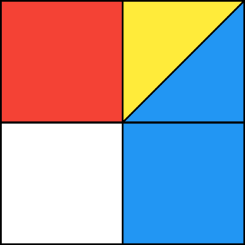

# Flutter-Mondrian

A Flutter application to generate Mondrian-like art pieces. This application will generate a random piece of art on launch in the style of Mondrian. https://en.wikipedia.org/wiki/Piet_Mondrian

This application has been tested on an emulated Nexus 5x running API 28, since I don't have an iOS device for testing.
